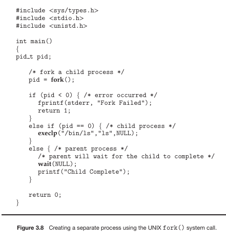

# Arquitetura esperada:

```
lgsc/
|
|-- .C
|-- .h
|--README
|--makefile
```
no final ser compactado para .tar -> lgsc.tar
```bash
tar -cvf nome_do_arquivo.tar pasta_a_ser_compactada/   
```

RELATORIO -> .pdf

pdf, tar e link github -> enviados no classroom

# to do
- [ x ] pesquisar como faz aparecer esse prompt `processFlow>` [OK]
- [ x ] pesquisar melhor como se faz a leitura e tratamento de arquivos passados por parameto [OK]
- [ ] ler o restante do cap 3 e ver sobre as system calls (wait, fork, exec, etc)

# Como sera
- O orquestrador vai automatizar e coordenar tarefas em multiplos sistemas de forma centralizada, atuando como um maestro (IA search)
- Arquivo em C que recebe as tasks via args

## modos diferentes
### interativo
- deve executar e aparecer no terminal (processflow>) -> pesquisar como faz isso [OK]
- usuario deve digitar os comandos 
```bash
Sintaxe:
processflow> task <nome> <programa> [argumentos...]

Ex:
processflow> task listar /bin/ls -l
```
- é necessario para criar uma nova tarefa

### workflow
- recebe um arquivo .pf como argumento, contendo comandos para ser executados [OK]
- é o modo interativo mas especifico para receber arquivos e trata-los [OK]
- o prompt (processflow>) nao sera exibido [OK]
- cada linha do arquivo lido devera ser printada na tela antes de ser executada [OK]

## comandos
- para ambos os modos, para sair, sera o comando `exit` [OK]
- para executar as tarefas cadastradas, devera ser executada com `run <nome_tarefa>`

### modos execucao
- mais de uma tarefa pode ser passada no comando e ser executada:

#### sequencial
- a tarefa deve **somente iniciar quando a anterior terminar** (avisar quando terminar para poder passar para a proxima)
```bash
Sintaze:
processflow> run sequential tarefa1 tarefa2 tarefa3
```

#### paralelo
- todas as tarefas devem ser iniciadas antes que o ProcessFlow espere pelo término do grupo. ???
```bash
Sintaxe:
processflow> run parallel tarefa1 tarefa2 tarefa3
```

## deve suportar
### Pipe ( | )
- a saida de uma tarefa pode ser enviada como a entrada de outra, como em um | 
```bash
Sintaxe:
processflow> run pipe <tarefa1> <tarefa2> <tarefa3>
Ex:
processflow> run pipe listar ordenar contar
```

### redirecionamento ( > )
- uma tarefa pode receber sua entrada DE um arquivo OU enviar SUA saida para um arquivo
```bash
EX:
processflow> input ordenar nomes.txt //ordenar recebe como entrada oq esta em nomes.txt ???
processflow> output ordenar resultado.txt //a saida de ordenar vai para resultado.txt ???
processflow> append ordenar historico.txt //adiciona a saida de ordenar em historico.txt
```

### diretorios de trabalho
- comando `workdir` serve como uma junção do `mkdir` e do `cd` e altera o diretório utilizado pelas tarefas executadas posteriormente. Ex: `workdir pasta/` e `run tarefa1`, o comando run sera executado dentro da pasta. ???

### execução em background
- comando `start <tarefa>` inicia a tarefa em segundo plano e mostra o prompt (processflow>) mesmo se a tarefa nao terminar
- deve printar um id do job e o PID do processo -> pesquisar no livro

### job
- comando `jobs` deve listar os jobs que foram iniciados em background pelo comando `start`

### wait
- comando `wait <job_ID>` aguarda o termino de um job



## como rodar
```bash
iniciar programa:
./processflow [workflowFile] //opcional
```
- se nao passar workflowFile, deve iniciar no modo Interativo (onde aparece o prompt e tal) [OK]

## observações
- checar os parametros antes de aceitar e retornar uma mensagem de erro explicando o problema e continuar o processo ou cancelar 
### deve:
#### IMPRIMIR uma mensagem e ENCERRAR o programa quando:
- numero incorreto de parametros for passado ao INICIAR o processFlow
- arquivo workflow nao existe ou nao pode ser aberto (n tem permissao, etc) [OK]

#### IMPRIMR uma mensagem e CONTINUAR o programa quando:
- uma tarefa passada como parametro nao existir
- o programa associado à tarefa nao existir ou nao puder ser executado
- um arquivo de entrada ou saida nao puder ser aberto (| > input e output)
- um job passado nao existir
- um diretorio informado em workdir nao existir

#### outros casos (forma coerente)
- nao passar nenhuma coisa/comando no prompt (processFlow> ) -> retorna nada
- varios espacos em brancos em uma linha -> usar aquela funcao de remover os espaços
- processos que terminam com codigo de saida diferente de zero -> mostrar o retorno ??
- procesoss em paralelo terminando em ordens diferentes -> retornar a ordem que foi terminada